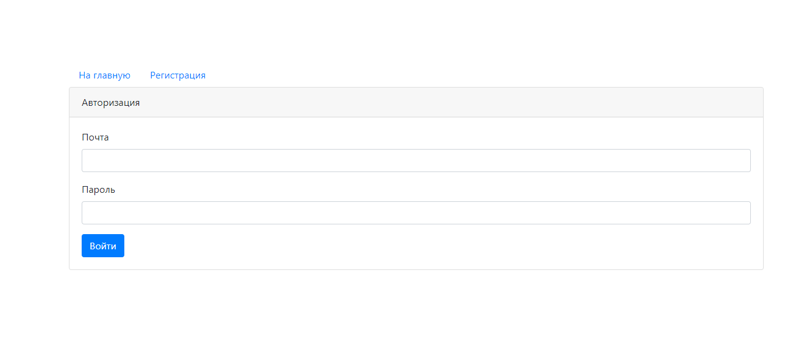
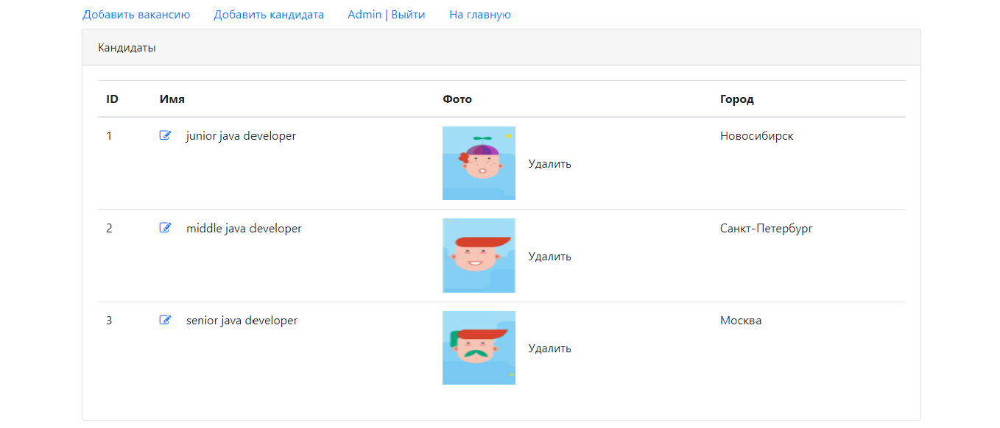
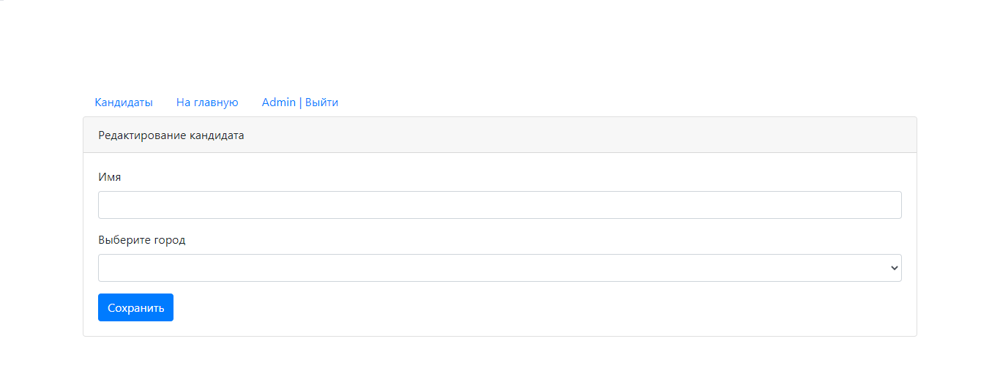
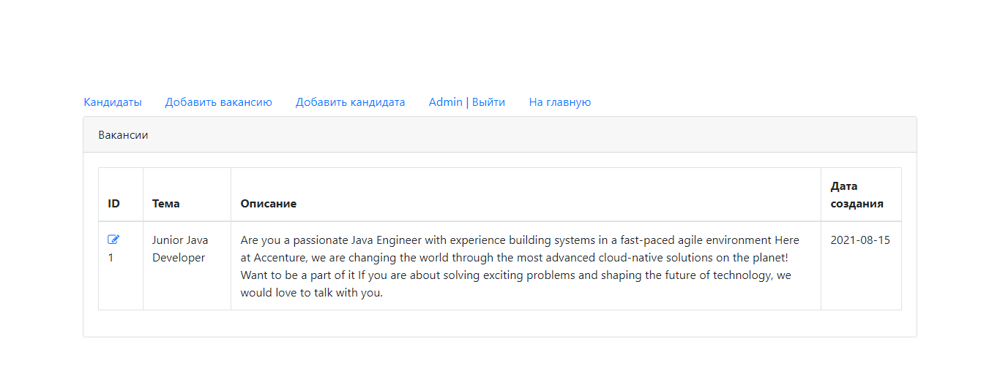
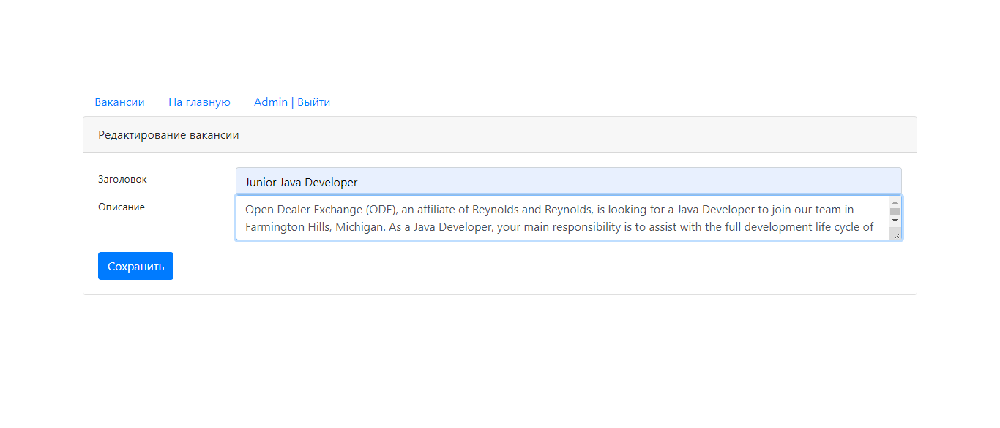

<h1>
job4j_dreamjob
</h1>

<h3>Description :</h3>

This project represents labor exchange.

The app provide CRUD operations based on database query.

<h4>
Used technologies :
</h4>
<ul>
<li>Servlets</li>
<li>JDBC</li>
<li>PowerMock</li>
<li>JUnit</li>
<li>Slf4j</li>
<li>Checkstyle</li>
</ul>

Web-Service has a 5 screens

<ul>

<li>
Log-in or registration in the service
</li>

<li>
List of candidates
</li>

<li>
Candidate profile editing
</li>

<li>
List of vacancies
</li>

<li>
Vacancy editing
</li>

</ul>
<h3>
Configurations :
</h3>

To app boot is necessary use Apache Tomcat and edit run configuration. 
This configuration should have follow points : 

<ul>
<li>
'http://localhost:8080/dreamjob' as start page url;
</li>
<li>
'job4j_dreamjob:war exploded' as build artifact;
</li>
<li>
'/dreamjob' as application context
</li>
</ul>

NOTICE, before first run is necessary use maven compile command
('mvn compile' for console input, or phase 'compile' of Maven Lifecycle in case compile from IDE).

After success compile, Liquibase create schema in Database. 
For authorize in service You might input 'root@local' in email form 
and 'root' in password form of start page.

<h3>Contact</h3>

If You have any question, please contact me:

https://t.me/roman_kozlov

